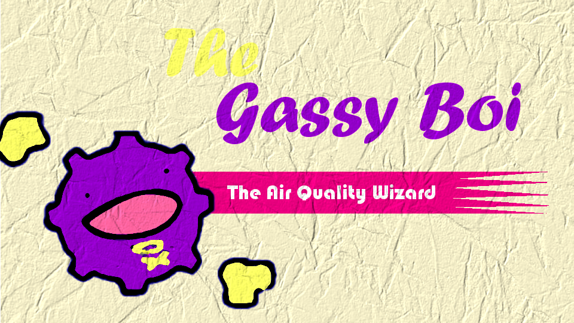

# Gassy Boi
Measures air quality from the inputs of a SGP30 air quality sensor and pushes slack notificationa when air quality exceeds unsafe thresholds.

Add the webhook url in `main.py` file.
sorry
	this
		isnt
			a
				config
			
		
	

Run `python  server.py` to get the persistent Http server script up.

Run `python main.py` to get the state machine that pushes slack messages up.